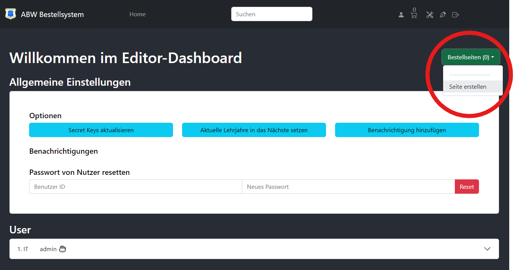

# ABW Bestellsystem

<p align="center">
   
</p>


Thanks for using our opensource version of the ABW Bestellsystem. This is a web application to manage orders for Azubis. It is written in ReactJS and NodeJS and uses MongoDB as database.

## Features
- Multiple Sites for mutiple locations to order from
- Multiple Products per Site
- Order by Email
- "Runners" that can pick up orders
- "Admins" that can manage the their group
- "Editors" that can manage the whole system

## Supported languages
- German 
- English (in progress) 

# Quick Start

1. Download the opensource_install.sh
2. Run the script with `sudo bash opensource_install.sh`
3. Select 1) to download the latest version & configure your installation
4. done

### After first login:

After the first login you will be redirected to the editor page. You need to create a new Site and add some Items to it.


# Additional Configuration

## Using a reverse proxy with nginx

```
server {

   ...

   # subfolder for the frontend
   # example: /order
   location /<your_frontend_url> {
      proxy_pass http://127.0.0.1:6969/;
      proxy_set_header Host $host;
      proxy_set_header X-Real-IP $remote_addr;
      proxy_set_header X-Forwarded-For $proxy_add_x_forwarded_for;
   }


   # subfolder for the api
   # example: /order/api/
   location /<your_api_url>/ {
      proxy_pass http://127.0.0.1:42069/;
      proxy_set_header Host $host;
      proxy_set_header X-Real-IP $remote_addr;
      proxy_set_header X-Forwarded-Proto $scheme;
      proxy_set_header X-Forwarded-For $proxy_add_x_forwarded_for;
   }
}
```

## Create a backup

Execute the following command to create a backup:
```bash
docker exec <mongodb container> sh -c 'mongodump --authenticationDatabase admin -u <user> -p <password> --db <database> --archive' > <backup file>
```
For example:
```bash
docker exec order_mongodb_1 sh -c 'mongodump --authenticationDatabase admin -u orderadmin -p Password123 --db orderdb --archive' > order.dump
```

## Restore a backup

Execute the following command to restore a backup:
```bash
docker exec -i <mongodb container> sh -c 'mongorestore --authenticationDatabase admin -u <user> -p <password> --db <database> --archive' < <backup file>
```
For example:
```bash
docker exec -i order_mongodb_1 sh -c 'mongorestore --authenticationDatabase admin -u orderadmin -p Password123 --db orderdb --archive' < order.dump
```
